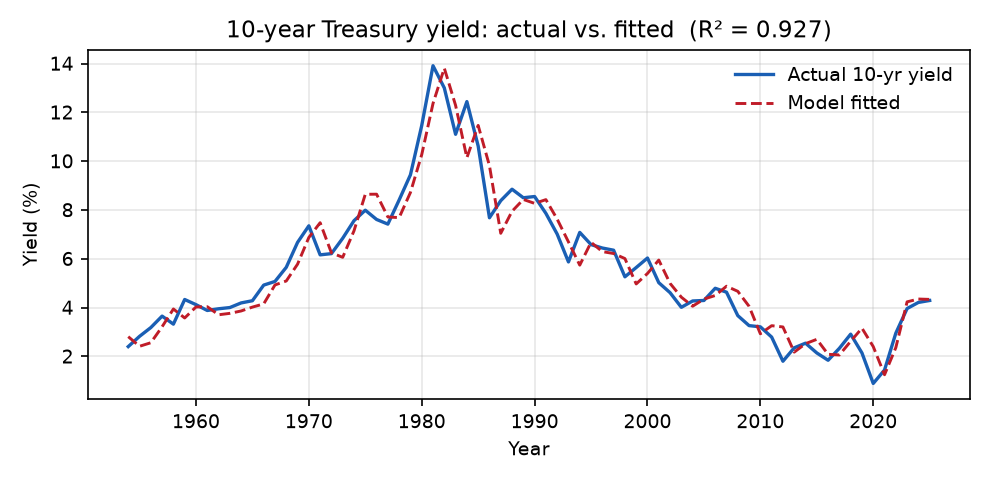
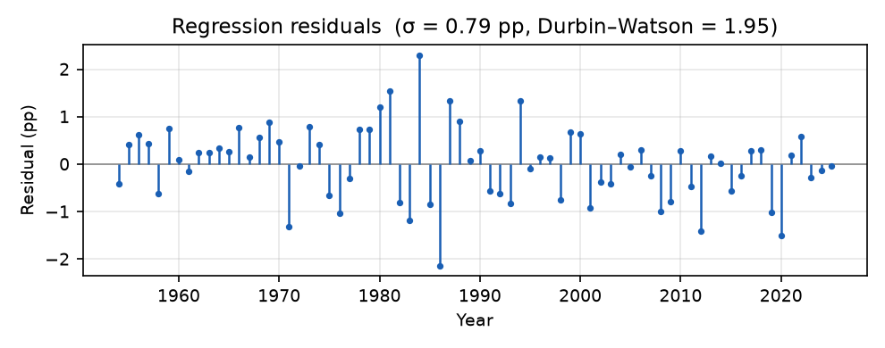
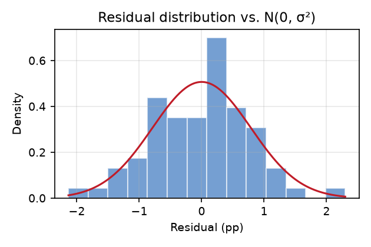
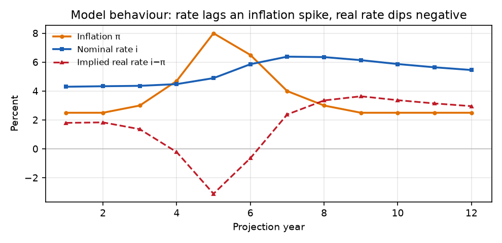

# Equity Portfolio Withdrawal Simulator — Methodology

*How the Monte Carlo simulation works, and the data and research it rests on.*

[TOC]

## 1. What is being modeled

The simulator evaluates a retirement spending strategy that **keeps the money
invested in equities** and, each year, withdraws **what a life annuity *would*
pay** on the current balance. It is explicitly **not** a model of buying an
annuity: there is no mortality pooling and no income guarantee, so a poor
sequence of early returns can deplete the balance. The annuity payout is used
only as a *spending rule* — a longevity-aware way to decide how much to take each
year.

A single run projects one random path; the Monte Carlo driver repeats this over
thousands of paths and reports the distribution of outcomes.

The pieces and their data flow:

```
Pricing (per-year annuity payout):
    SOA 2012 IAM tables ──> annuity_pricing.py   (local, default)
    immediateannuities.com ──> annuity_quote.py  (optional: --quotes site)

Scenarios (equity + inflation):
    market_data.py         ──┐   US, 1928–2025
    global_market_data.py  ──┴─> equity_model.py   global/postwar, 1871–2020 (JST)

Simulation:
    withdrawal_projection.py  (one path)  ──>  montecarlo.py  (many paths + CIs)
```

## 2. The inputs, option by option

Every input below appears in the desktop GUI, the web form, and as a
command-line flag. This section explains **what each does and why it is there**;
later sections give the underlying math. Defaults shown are the GUI/web defaults.

### 2.1 Who, and how much

- **Amount** *(default \$1,000,000)* — the starting invested balance, in today's
  dollars. Outcomes scale almost linearly with it, so it mainly sets the units.
- **Age** *(default 65)* and **Gender** *(default M)* — the primary annuitant.
  These select the mortality table used to price the payout (Section 4): an older
  age implies fewer expected remaining years, so the annuity-equivalent payout
  *rate* is higher. Allowed ages are 40–90.
- **Joint age** / **Joint gender** *(default 65 / F)* — an optional second life.
  When both are given the payout is priced as a **last-survivor** annuity, which
  pays while *either* person is alive. Because a couple's combined lifespan is
  longer than one person's, the payout rate is **lower** — more conservative
  spending — than for a single life. Leave both blank for a single-life
  projection; the default models a 65-year-old couple.
- **State** — used only with live **site** quotes, where insurer payouts vary by
  state of residence. Under the default local pricing it is ignored (use any
  value, or `OTHER`).

### 2.2 How long, and how many

- **Years** *(default 35)* — the projection horizon. 35 years reflects planning
  to roughly age 100 for a 65-year-old, i.e. provisioning for **longevity** rather
  than just life expectancy.
- **Sims** *(default 5,000)* — the number of independent random paths. More
  simulations give smoother, more stable percentiles at the cost of run time.
- **Seed** *(default blank)* — the random-number seed. Blank draws fresh each run;
  setting an integer reproduces an identical run, which is useful for comparing
  one changed input at a time.

### 2.3 The return scenario

- **Model** *(default global)* — which historical return **sample** to draw from:
  **us**, **global**, or **postwar** (Section 3). In short, the US has been an
  outlier, so **global** and **postwar** give a more cautious,
  internationally-grounded picture of the future.
- **Block length** *(default 5 years)* — the length of each resampled run of
  consecutive years. It controls how much **sequence risk** — multi-year runs of
  good or bad markets, and persistent inflation — is carried into each path. A
  length of 1 is an IID resample with no persistence; larger blocks impose more.

### 2.4 Spending guardrails (upper and lower bounds)

The annuity-equivalent rule re-prices the payout on the *current* balance every
year, so spending naturally rises after good markets and falls after bad ones.
Two optional factors clamp that, expressed as multiples of **year 1's withdrawal
in today's dollars**:

- **Upper bound** *(default 1.5)* — the maximum factor. It **caps** spending so
  that, even after a strong market run, you never withdraw more than 1.5× your
  first-year amount in real terms. Its purpose is to **preserve capital when the
  market does very well** rather than ratcheting consumption up with every gain —
  leaving more invested for later years and for a bequest. Without a cap, a few
  good early years pull both spending and depletion risk up sharply.
- **Lower bound** *(default blank)* — the minimum factor. It **floors** spending
  so that, even as the balance shrinks, withdrawals don't fall below this multiple
  of the first-year amount, maintaining a minimum standard of living. The
  trade-off is that withdrawing more than the balance can support **accelerates
  depletion**, so a floor raises the chance of running the account to zero.

Both clamp the **cash actually withdrawn**, so the effect feeds back into the
surviving balance (Section 5). Leaving a bound blank disables it.

### 2.5 Pricing the payout

- **Quotes** *(default local)* — how the payout is priced: **local** uses the
  offline SOA mortality-table model (Section 4); **site** fetches a live quote
  from immediateannuities.com. Local is the default and is what the web app uses;
  site requires network access and a valid **State**.
- **Interest rate** *(default 4.3%)* — the discount rate used to price the payout
  in local mode (Section 4.2). A higher rate raises the payout, and thus the
  withdrawal. In constant-inflation mode it is fixed for the whole projection; in
  dynamic mode it is the *starting* rate (Section 8). It has no effect under
  **site** quotes.
- **Scale G2 mortality improvement** *(default on; local only)* — projects the
  2012 base mortality forward for expected future gains in longevity
  (Section 4.3). Because people are assumed to live longer, the payout rate is
  **lower** (more conservative).

### 2.6 Inflation handling

- **Inflation** *(default blank)* — in constant mode, the single assumed annual
  CPI rate used to express results in today's dollars (Section 3.1). Real
  (today's-dollar) outcomes are essentially **invariant** to this number, because
  each sampled year's return is restated onto the chosen basis; it mainly affects
  the *nominal*-dollar figures. A blank reads as 0%, and it is ignored in dynamic
  mode (which samples its own inflation).
- **Dynamic inflation + rate** *(default off; `us` sample + local only)* — instead
  of a constant assumption, each path uses its own sampled inflation and a
  discount rate that evolves with it (Section 8). It is restricted to the **us**
  sample because the rate model is calibrated on US data; it is disabled for the
  global/postwar samples.

## 3. The equity and inflation scenario model

Each projected year needs a **nominal equity return** (to grow the account) and
an **inflation rate** (to express results in today's dollars). Because equity
returns and inflation are correlated, they are drawn **jointly** rather than
independently — a sampled year always carries both numbers together.

**Data sources.** Two paired annual datasets are available:

- **United States, 1928–2025** (98 years): S&P 500 nominal total return
  (dividends reinvested), from Damodaran / NYU Stern [4], paired with CPI-U
  annual-average inflation [5]. (`market_data.py`)
- **Broad developed markets, 1871–2020** (16 countries that have equity data;
  ~2,260 country-years): per-country nominal equity total return and CPI
  inflation from the **Jordà–Schularick–Taylor Macrohistory Database** [14]
  (`global_market_data.py`). The US has been an *ex post* outlier among developed
  markets — its realised returns sit near the top of the cross-section and its
  worst drawdowns are mild next to the war- and hyperinflation-era losses other
  countries suffered — so a forward-looking distribution is arguably better drawn
  from many markets than from the US alone [15].

**Sampling.** All samples use a **circular block bootstrap** [3]: consecutive
runs of `block_length` years (default 5) are resampled and stitched together,
wrapping around the series end. Versus an IID resample this preserves **serial
correlation** — momentum, mean reversion, and multi-year runs of high or low
inflation — which is what makes *sequence-of-returns* risk show up and which
widens the left tail of multi-year outcomes. (Historical resampling is preferred
over normal-based Monte Carlo for retirement risk work, which understates tail
risk and overstates safe withdrawal rates [1, 2].) For the multi-country samples
each block is drawn from a **single country** (countries weighted by their number
of years), so within-country sequence risk is preserved while the cross-section
of national outcomes enters the distribution.

Three return **samples** are offered (`equity_model.py`, the "Model" input):

- **us** — the US series alone (1928–2025).
- **global** — the full broad developed-market sample (1871–2020). The most
  cautious: it includes catastrophic equity outcomes the US never experienced
  (e.g. Germany and Japan around WWII, with real one-year losses near −90%).
- **postwar** — the same broad sample restricted to **1950 and later**. The
  rationale is that the post-WWII global order (Bretton Woods and its successors,
  no great-power war among developed economies, modern independent central
  banking) is a more relevant guide to the future than the 1870–1945 era of world
  wars and hyperinflations. It sits between **us** and **global** — broader than
  the US, but without the pre-war disasters.

Each report prints summary statistics for the chosen sample (in **real** terms,
so hyperinflation years do not distort them).

### 3.1 Two inflation modes

The simulator supports two ways of handling inflation:

- **Constant** (default). Inflation is a single assumption (`--inflation`, default
  **2.5%**), used only to deflate results to today's dollars, and the annuity
  discount rate is fixed (`--interest`, default 3.5%). To keep the equity series
  consistent with the constant assumption, each sampled year's *nominal* equity
  return is **restated** onto that basis — its embedded historical inflation is
  stripped out (preserving the real return) and the constant rate re-applied:

  ```
  real     = (1 + nominal) / (1 + historical_inflation) − 1
  restated = (1 + real) × (1 + assumed_inflation) − 1
  ```

  so the historical inflation once correlated with equity has no residual effect.

- **Dynamic** (`--dynamic-rates`). Inflation is *not* held constant: each path
  uses its own per-year sampled inflation directly (from the block bootstrap, so
  persistence is preserved), it deflates results to today's dollars, **and** it
  drives an evolving annuity discount rate. Equity is used as drawn (no
  restatement), so the historical equity/inflation pairing stays intact.
  Section 8 specifies and estimates this mode. Dynamic mode is available **only
  with the `us` sample** (and local pricing): the discount-rate model is
  calibrated on US data, so evolving it from a foreign — possibly hyperinflation —
  inflation path is not meaningful. The `global` and `postwar` samples therefore
  always use the constant-inflation mode (their results are real, and real
  outcomes are invariant to the constant chosen).

## 4. Annuity pricing (local SOA-table model)

By default the per-year payout is priced **offline** from published mortality
tables (`annuity_pricing.py`); live quotes from immediateannuities.com [6] are an
opt-in alternative (`--quotes site`).

### 4.1 Mortality tables

The base mortality is the **Society of Actuaries 2012 Individual Annuity
Mortality (IAM) Basic Table**, by sex, age-nearest-birthday [7]:

- `soa_mortality_2581.csv` — *2012 IAM Basic Table – Male, ANB* (ages 0–120)
- `soa_mortality_2582.csv` — *2012 IAM Basic Table – Female, ANB* (ages 0–120)

These are **annuitant** tables: annuitants are healthier and longer-lived than
the general population. Optional generational mortality improvement uses **SOA
Projection Scale G2** [7]:

- `soa_mortality_2583.csv` — *Projection Scale G2 – Male, ANB* (ages 0–105)
- `soa_mortality_2584.csv` — *Projection Scale G2 – Female, ANB* (ages 0–105)

### 4.2 Actuarial present value

With a flat interest rate `i` and survival probabilities `tpx` (the probability a
life now aged `x` survives `t` years, built from the table's one-year mortality
rates `q_x`), the actuarial present value of \$1 per year of income paid
**monthly, in arrears, while alive** is [8]:

```
v        = 1 / (1 + i)
a_x      = sum over t ≥ 1 of v^t · tpx        (annual annuity-immediate)
a_x^(12) ≈ a_x + 11/24                         (Woolhouse 2-term, m = 12)
```

The premium buys income at that price, so the **level annual payout** is

```
annual_payout = premium / a_x^(12).
```

For two lives, a **last-survivor** annuity pays while *either* is alive; its
factor follows from inclusion–exclusion [8],

```
a_LS = a_x + a_y − a_xy,
```

where `a_xy` (both alive) uses the product of the two independent survival
curves, with the same +11/24 monthly adjustment. The table's top age (120) is
treated as certain death, so the survival curve terminates cleanly.

### 4.3 Mortality improvement (Scale G2)

With `--improvement`, the 2012 base rates are projected forward **generationally**
to the quote year [7]:

```
q_a(year) = q_a(2012) · (1 − g2_a)^(year − 2012),
```

applied as each cohort ages, so the calendar year at attained age `a` is
`quote_year + (a − start_age)`. Improvement lengthens lifespans and therefore
*lowers* the payout. (Scale G2 grades to zero by its terminal age; attained ages
beyond it receive no further improvement.)

### 4.4 Calibration against the market

The model carries **no insurer expense, profit, or interest-rate load**, so it is
a clean actuarial benchmark rather than a marketed quote. Compared against live
immediateannuities.com quotes [6] for ages 60/65/70/80, the model pays roughly
**80–94%** of the site at the default 3.5% interest, and **matches the site at
about 5%** interest. That ~5% is consistent with a current 10-year nominal yield
of roughly a 2.3% real rate plus ~2.5% inflation (Section 8).

## 5. The withdrawal mechanism (one path)

Starting from the invested `amount`, for each projected year
(`withdrawal_projection.py`):

1. Price the monthly annuity payout per dollar at the current age and balance
   (Section 4); the payout is linear in premium, so one rate per age is computed
   and scaled.
2. Withdraw **12 ×** that monthly payout from the balance.
3. Grow the remaining balance by that year's nominal equity return.
4. Increment the age(s) by one and repeat.

Optional `--upper-bound` / `--lower-bound` cap and floor the annual withdrawal
**in today's dollars**, as factors of year 1's withdrawal (e.g. cap at 1.2× and
floor at 0.5×); the clamp is applied to the cash actually withdrawn, so it feeds
back into the surviving balance.

## 6. Monte Carlo aggregation

`montecarlo.py` runs many independent paths (default **5,000**) and summarizes
the distribution:

- **Ending balance**, in both nominal and today's dollars: mean, median, and the
  central **80% / 90% / 95% / 99%** confidence intervals. A "C% interval" is the
  central range covering C% of outcomes — the `[(100−C)/2, 100−(100−C)/2]`
  percentile band (e.g. 80% = 10th–90th percentile).
- **Annual payout by year**, in today's dollars: the same statistics, per year.
- **Downside**: the share of paths whose real ending balance finishes below the
  starting amount, and below half of it.
- **Worst real returns**: the worst single-year and worst cumulative five-year
  *real* (inflation-adjusted) equity total return seen anywhere in the run. This
  is the **market** return itself, before any withdrawal — not the change in the
  account balance, which falls by more in a down year because spending is also
  taken out.

The annuity-rate cache is built once per run and reused across all paths, so
pricing cost (and any network traffic) stays at roughly one rate per age
regardless of the number of simulations.

## 7. Key assumptions and caveats

- This models withdrawing the annuity-*equivalent* amount while staying invested.
  It is **not** an annuity purchase — no mortality pooling, no income guarantee.
  Because the full annuity payout includes return of principal, the withdrawal
  rate is high and the real balance typically erodes; single-life runs commonly
  finish below the starting amount in real terms. This is expected model
  behavior, not a defect.
- Local pricing omits insurer loads, so it is an actuarial benchmark, not a
  quotable rate; results are sensitive to the assumed interest rate.
- Historical calibration assumes the 1928–2025 distribution is informative about
  the future, which may not hold.
- Mortality follows population-level annuitant tables; no individual health
  underwriting is performed.

## 8. Dynamic inflation and interest rates

The dynamic mode (`--dynamic-rates`, `rate_model.py`) makes inflation vary year
to year and ties the annuity discount rate to it, so a higher-inflation path
produces higher nominal yields and a larger nominal annuity payout. Because
inflation and bond yields are persistent, correlated time series, the discount
rate is modelled with **lagged** dependence rather than as a static function of
the current year's inflation.

### 8.1 Specification

The design is **layered**: inflation keeps coming from the block bootstrap of
Section 3 (which already preserves its serial persistence and its pairing with
equity), and only the interest rate is added as a parametric process. The rate
partially adjusts each year toward a long-run **Fisher target** driven by the
*previous* year's inflation:

```
i*_t = a + b · π_{t−1}                                  (long-run Fisher target)
i_t  = (1 − λ) · i_{t−1} + λ · i*_t + ε_t,   ε_t ~ N(0, σ²)
```

`a` is the real-rate intercept, `b` the long-run inflation pass-through, and `λ`
the annual speed of adjustment. The rate in year *t* therefore depends on **both**
the prior year's rate (weight `1 − λ`) and the prior year's inflation. Year 1 is
priced at a given initial ("today's") rate `i₀` (`--initial-rate`, default 4.3% ≈
the current 10-year yield); the rate is floored at zero. The interest innovation
is drawn independently of the equity/inflation draws — a deliberate
simplification (see §8.5).

### 8.2 Estimation

The model is fit as the reduced form

```
i_t = c + ρ · i_{t−1} + δ · π_{t−1} + ε_t
```

by ordinary least squares, then mapped to the structural parameters via
`λ = 1 − ρ`, `a = c / λ`, `b = δ / λ`. The data are annual averages of the
**10-year Treasury constant-maturity yield** (Federal Reserve / FRED series
`GS10`, which begins in 1953) [11] and **CPI-U inflation** [5]; the usable sample
is **1954–2025 (n = 72)**. `rate_model.fit_interest_model()` reproduces this fit
(the script `fit_rate_model.py` prints it and regenerates the focused fit report
`FIT.md`/`FIT.pdf`), and the package defaults are exactly these estimates.

**Exhibit 1 — OLS estimates** (dependent variable: 10-year yield `i_t`):

| Term | Coefficient | Std. error | t-stat |
|------|------------:|-----------:|-------:|
| constant `c` | 0.00279 | 0.00202 | 1.38 |
| `i_{t−1}` (ρ) | 0.83477 | 0.04238 | 19.70 |
| `π_{t−1}` (δ) | 0.18645 | 0.04478 | 4.16 |

n = 72 (1954–2025)  ·  R² = 0.927  ·  adj. R² = 0.925  ·  residual σ = 0.79 pp  ·
Durbin–Watson = 1.95.

Mapped to structural parameters:

```
λ = 1 − ρ = 0.165      (annual adjustment speed)
a = c / λ = 1.69%      (real-rate intercept)
b = δ / λ = 1.13       (long-run inflation pass-through)
σ = 0.79 pp            (innovation standard deviation)
```

The lagged yield is overwhelmingly significant (t ≈ 20) and the lagged-inflation
term is significant (t ≈ 4.2); the model explains 93% of the variation in the
yield, and the Durbin–Watson near 2 indicates essentially no residual
autocorrelation — the lagged specification has absorbed the dynamics.







### 8.3 Implied dynamics

The estimates have a clear economic reading:

- **Long-run pass-through `b ≈ 1.13`** is slightly above one, consistent with the
  tax-augmented (Darby) form of the Fisher hypothesis.
- **Adjustment speed `λ ≈ 0.165`** is *small*: only about one-sixth of the gap to
  the Fisher target closes each year. This is the sluggish short-run pass-through
  (the Mundell–Tobin / "Fisher puzzle" effect, §8.4).
- The **long-run real rate is ≈ `a` = 1.7%**, and the steady-state nominal rate at
  2.5% inflation is `a + b·2.5% ≈ 4.5%` — close to both the current 10-year yield
  and the ~5% that reproduces live annuity quotes (§4.4).

Crucially, because `λ` is small, when inflation jumps the rate lags and the
**implied real rate `i_t − π_t` compresses and can go temporarily negative**,
recovering only as the rate catches up — exactly the 2021–2022 experience —
while the long-run real rate stays near 1.7%. Exhibit 4 illustrates this with a
deterministic inflation spike.



### 8.4 Research basis

The specification follows established findings on the yield/inflation link:

- **Fisher relationship [9].** A nominal yield ≈ expected real rate + expected
  inflation + term premium; over long horizons the pass-through is roughly
  one-for-one (cointegration evidence across OECD countries) — consistent with the
  fitted `b ≈ 1.1`.
- **Sluggish short-run pass-through (Mundell–Tobin / "Fisher puzzle") [10].** In
  the short run the pass-through is well below one, so when inflation jumps,
  nominal yields lag and the real rate compresses — captured here by the small
  fitted `λ` and the lagged inflation term.
- **The real rate is not constant — and not always positive [11, 12, 13].** The
  10-year TIPS (market real) yield was negative from December 2011 through ~2013
  and deeply negative in 2020–2022 (a record-low −0.93% 10-year TIPS auction in
  July 2020, around −1.2% in 2021). On a realized basis the divergence was
  extreme: with CPI near 7% at end-2021 and a 9.1% peak in mid-2022 against a
  10-year yield of ~1.5–3%, the **ex-post real yield was roughly −5% to −6%**. It
  is about +2.3% as of mid-2026. The error-correction model reproduces this
  behavior endogenously while remaining mean-reverting, so it cannot drift to
  implausible levels over a long horizon.

### 8.5 Usage and caveats

Enable with `--dynamic-rates` (local pricing only); set the starting rate with
`--initial-rate`. Caveats specific to this mode:

- The interest innovation `ε_t` is drawn **independently** of the equity and
  inflation draws. Contemporaneous correlation between rate shocks and
  equity/inflation is therefore omitted; this is a simplification, not an
  estimate of zero correlation.
- Parameters are fit on **1953–2025** (the span of the GS10 series), a shorter
  window than the 1928–2025 equity/inflation data, and assume that historical
  yield/inflation relationship continues to hold.
- The model is of the **nominal** rate; the "larger payout" from higher inflation
  is largely a nominal effect, and is deflated away when results are expressed in
  today's dollars (a level annuity loses real value faster under high inflation).

## References

1. Pfau, W. D. (2010). *An International Perspective on Safe Withdrawal Rates: The
   Demise of the 4 Percent Rule?* Journal of Financial Planning, 23(12).
2. Efron, B. (1979). *Bootstrap Methods: Another Look at the Jackknife.* The
   Annals of Statistics, 7(1), 1–26.
3. Politis, D. N., & Romano, J. P. (1992). *A Circular Block-Resampling Procedure
   for Stationary Data.* In *Exploring the Limits of Bootstrap*, Wiley. (See also
   Künsch, H. R. (1989), Annals of Statistics 17(3), 1217–1241.)
4. Damodaran, A. *Historical Returns on Stocks, Bonds and Bills: 1928–Current.*
   NYU Stern. https://pages.stern.nyu.edu/~adamodar/New_Home_Page/datafile/histretSP.html
5. U.S. Bureau of Labor Statistics, *CPI-U*, via *Historical Inflation Rates.*
   https://www.usinflationcalculator.com/inflation/historical-inflation-rates/
6. ImmediateAnnuities.com. *Average estimated immediate-annuity income quotes.*
   https://www.immediateannuities.com/
7. Society of Actuaries / American Academy of Actuaries, Life Experience
   Subcommittee (2011). *2012 Individual Annuity Reserving (IAR) Table and 2012
   IAM Basic Table, with Projection Scale G2.* SOA Mortality and Other Rate Tables
   (mort.soa.org), table identities 2581–2584.
   https://mort.soa.org/ViewTable.aspx?TableIdentity=2584
8. Dickson, D. C. M., Hardy, M. R., & Waters, H. R. (2020). *Actuarial
   Mathematics for Life Contingent Risks* (3rd ed.). Cambridge University Press —
   life annuities, the Woolhouse `m`-thly formula, and multiple-life (last
   survivor) functions.
9. Fisher, I. (1930). *The Theory of Interest.* Macmillan.
10. Mundell, R. (1963). *Inflation and Real Interest.* Journal of Political
    Economy, 71(3); Tobin, J. (1965). *Money and Economic Growth.* Econometrica,
    33(4). (Mundell–Tobin effect / short-run Fisher "puzzle.")
11. Federal Reserve Bank of St. Louis, FRED. *Market Yield on U.S. Treasury
    Securities at 10-Year Constant Maturity* — series **GS10** (monthly, averaged
    to annual; used to fit the interest-rate model in `rate_model.py`), with
    **DGS10** (daily nominal) and **DFII10** (inflation-indexed/real).
    https://fred.stlouisfed.org/series/GS10
12. American Enterprise Institute. *Treasury Yields, Inflation, and Real Interest
    Rates: Analyzing the Historical Record.*
    https://www.aei.org/economics/treasury-yields-inflation-and-real-interest-rates-analyzing-the-historical-record/
13. *New 10-Year TIPS Gets Real Yield of −0.93%, Lowest in History.* Seeking
    Alpha (July 2020).
14. Jordà, Ò., Knoll, K., Kuvshinov, D., Schularick, M., & Taylor, A. M. (2019).
    *The Rate of Return on Everything, 1870–2015.* Quarterly Journal of
    Economics, 134(3), 1225–1298. Data: **Jordà–Schularick–Taylor Macrohistory
    Database** (macrohistory.net), release R6; see also Jordà, Schularick &
    Taylor (2017), *Macrofinancial History and the New Business Cycle Facts.*
    Used under CC BY-NC-SA 4.0.
15. Anarkulova, A., Cederburg, S., O'Doherty, M. S., & Sias, R. (2023). *The Safe
    Withdrawal Rate: Evidence from a Broad Sample of Developed Markets.* Working
    paper (SSRN 4227132).
