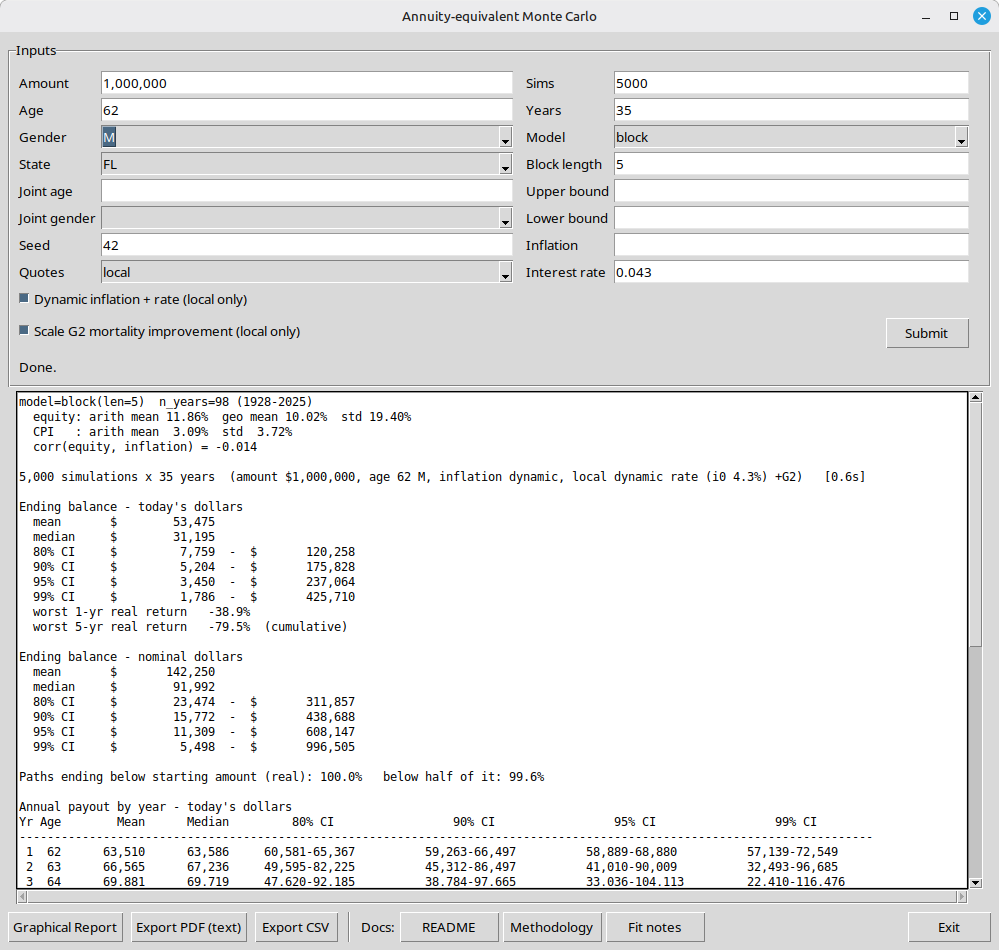

# Equity Portfolio Withdrawal Simulator

Tools for projecting retirement withdrawals under a strategy that keeps the money
invested in equities and each year withdraws what a **life annuity would pay** on
the current balance — then stress-tests that strategy with Monte Carlo simulation.

Annuity payouts are priced by default from a **local, offline model** built on the
SOA 2012 IAM mortality tables; live quotes from
[immediateannuities.com](https://www.immediateannuities.com/) are available as an
opt-in alternative (`--quotes site`). Equity-return scenarios are driven by
historical S&P 500 data (1928–2025); inflation is a constant assumption
(default 2.5%) used to express results in today's dollars — or, with
`--dynamic-rates`, it varies year to year and **drives an evolving annuity
discount rate** fit to historical Treasury yields (see `METHODOLOGY.pdf`).

## Disclaimer

**These programs are for educational purposes only and must not be taken as
financial advice.** Appropriate investment advice varies between individuals and
the analysis performed by the programs in this repository **do not** contemplate
any such individual circumstances. Equity investment can lose money. The
projected cashflows from the investment strategies modeled here are
**speculative** and are likely to differ **significantly** from actual
experience going forward.

The scripts in this repository likely contain errors. There is **ABSOLUTELY NO
WARRANTY** for the software in this repository; see the [License](#license) for
the full warranty disclaimer and limitation of liability.

Additional modeling caveats: this models withdrawing the annuity-*equivalent*
amount while staying invested — it is **not** an annuity purchase, so there is no
mortality pooling and no income guarantee. Because the annuity payout includes
return of principal, the withdrawal rate is high and the real balance typically
erodes over time. The default local annuity pricing is a simplified actuarial
calculation (SOA 2012 IAM mortality at a flat interest rate, no insurer expense or
profit load) and is not a marketed rate; the optional site quotes are "average
estimated" figures, not binding offers.

## Setup

Requires **Python 3.14**. The default local annuity pricing runs fully offline;
network access is only needed for the opt-in live quotes (`--quotes site`) and the
`annuity_pricing.py --compare` benchmark. The only third-party dependency needed
to run the simulations is **NumPy**; **matplotlib** is an optional dependency
needed only for the graphical PDF report, and the **markdown** package is an
optional docs-only dependency, used solely to regenerate `README.html` from
`README.md`. The Tk GUI uses `tkinter` from the standard library.

```bash
git clone git@github.com:sf210/equity_portfolio_withdrawal_simulator.git
cd equity_portfolio_withdrawal_simulator

python -m venv .venv
source .venv/bin/activate
pip install -r requirements.txt
```

The virtual environment is intentionally **not** committed (it is large and
platform-specific); recreate it from `requirements.txt` as above. `.venv/` is
gitignored.

## How it fits together

Data flows one direction, from annuity pricing + historical data into a projection:

```
soa_mortality_258*.csv ──> annuity_pricing.py ─┐   (local, default)
immediateannuities.com ──> annuity_quote.py ───┤   (site, --quotes site)
market_data.py ──> rate_model.py ──────────────┤   (dynamic discount rate)
                                               ├─> withdrawal_projection.py ──> montecarlo.py ──> montecarlo_gui.py
market_data.py ──> equity_model.py ────────────┘     (one random path)         (many paths + CIs)   (Tk front-end)
```

## The scripts

### `annuity_pricing.py`
The **default annuity pricer** — a self-contained, offline actuarial calculation
on the SOA 2012 IAM mortality tables. It prices a single-premium immediate annuity
(SPIA): the level lifetime income a lump sum buys, paid monthly. Both
`withdrawal_projection.py` and `montecarlo.py` use it as their default payout
engine.

- **`single_life_annuity(amount, age, gender, interest_rate=0.035, ...)`** and
  **`last_survivor_annuity(amount, age1, gender1, age2, gender2, ...)`** return the
  **annual** payout. The last-survivor product pays as long as *either* person is
  alive.
- Method: actuarial present value with a flat interest rate, monthly-in-arrears
  timing (Woolhouse `a_x + 11/24`), and the last-survivor factor
  `a_LS = a_x + a_y − a_xy`.
- **`--improvement`** projects the 2012 base rates forward generationally with SOA
  Projection Scale G2 (`soa_mortality_2583.csv` / `2584.csv`), lowering payouts as
  lifespans lengthen.
- **`--compare`** benchmarks the model against live site quotes at ages 60/65/70/80.
  At the default 3.5% the model pays ~80–94% of the site; it matches the site at
  roughly **5%** interest (i.e. current site quotes imply ~5%, not 3.5%).

```bash
# single-life, $100k, 65-year-old male, default 3.5%
python annuity_pricing.py 100000 65 M

# last-survivor, 65M & 63F, at 4% with Scale G2 improvement
python annuity_pricing.py 100000 65 M --joint-age 63 --joint-gender F \
    --interest 0.04 --improvement

# benchmark the model vs the live site
python annuity_pricing.py --compare
```

The base tables are `soa_mortality_2581.csv` (male) / `2582.csv` (female); the
Scale G2 improvement tables are `2583.csv` / `2584.csv`. All are `age,d` CSVs.

### `annuity_quote.py`
The **opt-in site pricer** (`--quotes site`). Looks up the monthly life-annuity
payout for a lump sum by submitting the immediateannuities.com quote form
(assuming income begins in 1 month) and reading the dollar figure in the "Life"
row. Uses only the standard library; requires network access.

- **Inputs:** `amount age gender state`, plus optional `--joint-age` /
  `--joint-gender` for a joint-life (two-person) annuity.
- **Output:** the monthly payout as a bare number (no `$` or commas), so it pipes
  cleanly. Importable as `get_life_quote(...)`, which returns a `"$NNN"` string.

```bash
python annuity_quote.py 100000 65 M FL
# -> 685

python annuity_quote.py 250000 70 female CA --joint-age 68 --joint-gender M

# pipeable:
python annuity_quote.py 100000 65 M FL | awk '{print $1*12}'
```

### `market_data.py`
Not a CLI — a data module. Holds the paired historical series of S&P 500 nominal
total returns and CPI annual-average inflation, 1928–2025, keyed by year so the
two stay aligned, plus the annual 10-year Treasury yield (FRED `GS10`, from 1953)
used to fit the dynamic rate model. Exposes `equity_returns()`,
`inflation_rates()`, and `treasury_10y_regression_data()`.

### `rate_model.py`
The **dynamic discount-rate model** (used by `--dynamic-rates`). The annuity
discount rate is not fixed: it partially adjusts each year toward a long-run
Fisher target driven by the *previous* year's inflation (an error-correction
model), so higher-inflation paths get higher yields and larger nominal payouts,
while the implied real rate compresses — and can go briefly negative — when
inflation spikes, as in 2021–22. Parameters are **fit by OLS** to historical
10-year Treasury yields and CPI (1954–2025; `a ≈ 1.7%`, `b ≈ 1.13`, `λ ≈ 0.17`,
R² ≈ 0.93). `fit_rate_model.py` prints the fit and regenerates `FIT.md`/`FIT.pdf`;
the full derivation, error exhibits, and graphs are in `METHODOLOGY.pdf`.

### `equity_model.py`
The scenario generator. `JointReturnModel` samples one-year `(equity return,
inflation)` pairs **jointly**, preserving the historical equity/inflation
relationship. Three modes:

- **`bootstrap`** (default) — resample actual historical year-pairs (IID).
  Preserves the real distribution's fat left tail and skew.
- **`block`** — circular block bootstrap: resample consecutive runs of
  `block_length` years (default 5) to also preserve *serial* correlation
  (notably inflation's strong year-to-year persistence).
- **`lognormal`** — draw from a bivariate normal fitted to the log series; smooth
  but understates tail risk.

> **Note — how inflation is used.** In the default (constant) mode the simulators
> don't use the *sampled* inflation directly: inflation is a constant assumption
> (`--inflation`, default 2.5%) and each sampled year's paired historical inflation
> is used only to **restate** the equity return onto that constant basis (strip out
> the embedded historical inflation, keep the real return, re-apply the constant).
> Under `--dynamic-rates` the sampled inflation **is** used directly — to deflate to
> today's dollars and to drive the discount rate (`rate_model.py`) — and equity is
> left as drawn, so the historical equity/inflation pairing stays intact.

Run it directly to print the calibrated statistics:

```bash
python -c "from equity_model import JointReturnModel; print(JointReturnModel('block').summary())"
```

### `withdrawal_projection.py`
Simulates **one** random 30-year path. Each year it: prices the annuity payout
for the current balance and age (the payout is linear in premium, so a single
rate per age is computed and scaled), withdraws 12× that monthly payout, grows the
remainder by that year's equity return, then ages everyone by one year. Pricing is
local by default; with `--quotes site`, quote ages above 90 are clamped to the
age-90 rate (the site's maximum), while the local pricer handles any age.

- **Inputs:** `amount age gender state` plus `--joint-age`/`--joint-gender`,
  `--years` (default 30), `--inflation` (default 0.025), `--model`,
  `--block-length`, the pricing flags `--quotes local|site` (default `local`),
  `--interest` (default 0.035), `--improvement`, `--quote-year`,
  `--dynamic-rates`/`--initial-rate` (dynamic inflation + discount rate; see
  [`rate_model.py`](#rate_modelpy)),
  `--upper-bound`/`--lower-bound` (see [Withdrawal bounds](#withdrawal-bounds)),
  and `--seed`. The `state` argument is only used with `--quotes site`.
- **Output:** a calibration header, a year-by-year table (balance, **annual**
  payout, that year's equity return and inflation, ending balance), and the
  ending balance. **All dollar figures are nominal** — use `montecarlo.py` for
  the today's-dollar (inflation-adjusted) view.

```bash
# reproducible single path (local pricing at the default 3.5%)
python withdrawal_projection.py 1000000 65 M FL --seed 1

# local pricing at 4% with Scale G2 mortality improvement
python withdrawal_projection.py 1000000 65 M FL --interest 0.04 --improvement

# joint life via live site quotes, lognormal model
python withdrawal_projection.py 1000000 65 M FL --quotes site \
    --joint-age 63 --joint-gender F --model lognormal

# block bootstrap with 10-year blocks
python withdrawal_projection.py 1000000 70 F CA --model block --block-length 10

# dynamic inflation with a discount rate that tracks it
python withdrawal_projection.py 1000000 65 M FL --dynamic-rates --model block

# cap real spending at 120% and floor it at 50% of year 1
python withdrawal_projection.py 1000000 65 M FL --upper-bound 1.2 --lower-bound 0.5
```

Reusable functions for callers: `build_rate_cache(...)` and `simulate_path(...)`.

#### Withdrawal bounds

`withdrawal_projection.py` and `montecarlo.py` both accept optional
`--upper-bound` and `--lower-bound` **factors** that cap and floor the annual
withdrawal **in today's dollars**, relative to the **first year's** withdrawal.
For example, if year 1 withdraws the equivalent of $50,000 in today's dollars,
then `--upper-bound 1.2` limits every later year to at most $60,000 and
`--lower-bound 0.5` keeps every later year at no less than $25,000 (both in
today's dollars). The clamp is applied to the cash actually withdrawn, so it
feeds back into the surviving balance. By default there is no cap or floor.

### `montecarlo.py`
Runs **many** paths (default 5000) and reports the distribution of outcomes: the
mean, median, and 80% / 90% / 95% / 99% confidence intervals for both the ending
balance (nominal and today's dollars) and the **annual** payout by year (in
today's dollars). It builds the annuity-rate cache once and reuses it across every
path, so pricing cost (and any network traffic) stays at ~one rate per age
regardless of the number of simulations; with the default local pricing this is
instant and offline.

- **Inputs:** same as `withdrawal_projection.py` (including `--inflation`, the
  pricing flags `--quotes`/`--interest`/`--improvement`/`--quote-year`,
  `--dynamic-rates`/`--initial-rate`, and `--upper-bound`/`--lower-bound`), plus
  `--sims` (default 5000).
- A "C% confidence interval" is the central interval covering C% of outcomes
  (e.g. 80% = the 10th–90th percentile range).
- Each year's withdrawal is capped at the available balance, so the balance
  **never goes negative**; a path that depletes holds at zero (withdrawing zero)
  for its remaining years. The PDF report's balance chart uses a
  pseudo-log (symlog) y-axis so depletion to $0 and the wide tail-to-tail spread
  are both legible.
- The ending-balance (today's dollars) block also reports the **worst single-year**
  and **worst cumulative five-year** *real* (inflation-adjusted) equity total
  return seen anywhere in the simulation.
- When run interactively it then offers to save the report to a **PDF** or
  **CSV** file (type `PDF`, `csv`, or `exit` at the prompt); after each save it
  asks again, so you can write several files, and keeps prompting until you type
  `exit`. The **PDF** is a single consolidated, figure-rich report
  (`report_pdf.py`, matplotlib): summary cards, the balance fan chart,
  median/stress-scenario charts, and a per-year table — see the GUI section below.
  The prompt is skipped when output is piped or redirected.

```bash
# default 5000-path run (local pricing, offline)
python montecarlo.py 1000000 65 M FL

# local pricing at 4% with Scale G2 mortality improvement
python montecarlo.py 1000000 65 M FL --interest 0.04 --improvement

# dynamic inflation + discount rate that tracks it
python montecarlo.py 1000000 65 M FL --dynamic-rates --model block

# 2000 paths via live site quotes, block bootstrap, fixed seed
python montecarlo.py 1000000 65 M FL --quotes site --sims 2000 --model block --seed 1

# joint life, capping/flooring real spending relative to year 1
python montecarlo.py 1000000 65 M FL --joint-age 63 --joint-gender F \
    --upper-bound 1.2 --lower-bound 0.5
```

### `montecarlo_gui.py`
A Tcl/Tk (tkinter) desktop front-end for `montecarlo.py`, for running the
simulation without the command line.



The top **Inputs** panel collects the same parameters as the command line,
including **Inflation**, the **Quotes** source (local/site), a single **Interest
rate** (the fixed discount rate when static, or the starting rate when dynamic), a
**Dynamic inflation + rate** checkbox, and a **Scale G2 mortality improvement**
checkbox. The numeric **Inflation** and **Interest rate** fields read a blank
entry as **0**. Fields with a fixed set of
choices — **Gender**, **State**, **Model**, **Joint gender**, and **Quotes** — are
drop-downs; the rest are text entries, and blank optional fields (joint
age/gender, upper/lower bound, seed) are simply omitted. The whole form is
keyboard-navigable: **Tab** moves the focus through every input and on to the
**Submit** button, and pressing **Enter** while Submit has focus runs the
simulation — no mouse required.

The run happens on a background thread (the status line shows its progress) so
the window stays responsive while the annuity-rate cache is built (instantly for
local pricing; over the network for the site source). When it finishes, the full
report appears in the scrollable monospaced panel and the bottom buttons activate:

- **Export PDF** — save the single consolidated, figure-rich report
  (`report_pdf.py`, matplotlib). Page 1 leads with two **summary cards** (the
  ending-balance distribution in today's and nominal dollars — mean, median, the
  80/90/95/99% central intervals, and the worst real equity returns) and a
  highlighted downside line, above a **fan chart** of the end-of-year balance
  distribution in today's dollars (median plus central-interval bands, shaded
  green above the median and red below, darkening toward the tails so the
  unfavourable region stands out, on a pseudo-log y-axis so depletion to $0 is
  visible). A **Median and Stress Scenarios** section follows, pairing a dual-axis
  market-return / inflation / discount-rate chart with the mean/min/max annual
  withdrawal and ending balance for the median, 10th-, 2.5th-, and
  0.5th-percentile ending-balance paths, and finally a paginated **per-year
  summary table**.
- **Export CSV** — save the most recent report as numeric rows via a file dialog,
  using the same writer as the command-line tool.
- **Docs** (README / Methodology / Fit notes) — open the bundled documentation in
  the OS default viewer; available at any time, independent of a run.
- **Exit** — close the window.

Run it with a Python build that includes tkinter (the project `.venv` does):

```bash
python montecarlo_gui.py
```

## Man pages

Three troff man pages are included (section 1):

- `withdrawal_projection.1`
- `montecarlo.1`
- `annuity_pricing.1`

View them without installing:

```bash
man ./withdrawal_projection.1
man ./montecarlo.1
man ./annuity_pricing.1
```

(`annuity_quote.py`, `equity_model.py`, `market_data.py`, `rate_model.py`, and
`montecarlo_gui.py` do not have man pages; see the docstrings and `--help`.)

## Methodology documents

- **`METHODOLOGY.pdf`** (source `METHODOLOGY.md`) — how the whole Monte Carlo
  works end to end: the scenario model, annuity pricing, the dynamic
  inflation/rate model with its **fit, error exhibits, and graphs**, assumptions,
  and cited sources.
- **`FIT.pdf`** (source `FIT.md`, regenerated by `fit_rate_model.py --markdown`) —
  a focused report of the interest-rate model fit (OLS estimates, diagnostics).

Both are regenerated from Markdown; see the build steps in those source files.

## License

Licensed under the [Mozilla Public License 2.0](LICENSE). The software is provided
"as is", without warranty of any kind — see Sections 6 ("Disclaimer of Warranty")
and 7 ("Limitation of Liability") of the license.
